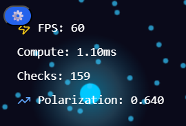
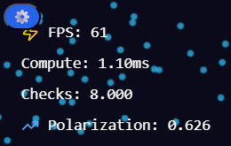

# Valg af algoritme

Projektet tilbyder to tilgange til at beregne påvirkning fra “opinion boids” på “user boids”:

1. Naiv algoritme (O(n²))
   Den naive metode sammenligner hver brugerboid med hver opinionsboid. Den er enkel og præcis, men bliver hurtigt tung, når antallet af boids vokser. Den egner sig mest til små datasæt eller som reference til test.

```js
const calculateInfluenceNaive = (userBoids, opinionBoids) => {
  let checks = 0;

  userBoids.forEach((user) => {
    let strongestInfluence = null;
    let strongestStrength = 0;

    opinionBoids.forEach((opinion) => {
      checks++;
      const dx = opinion.x - user.x;
      const dy = opinion.y - user.y;
      const dist = Math.sqrt(dx * dx + dy * dy);
      const range = opinion.radius * 3;

      if (dist < range) {
        const strength = 1 - dist / range;
        if (strength > strongestStrength) {
          strongestStrength = strength;
          strongestInfluence = opinion.opinion;
        }
      }
    });

    if (strongestInfluence !== null && strongestStrength > 0.3) {
      user.influence = strongestInfluence;
    }
  });

  return checks;
};
```

2. Optimeret algoritme med spatial grid (O(n))
   Den optimerede metode deler lærredet i et gitter og undersøger kun nabo-celler i stedet for hele mængden. Det reducerer antallet af nødvendige afstandsberegninger markant. Til en simulation med mange elementer er det et relevant valg, fordi man bevarer realtids­yde­lse uden at ændre på resultatets karakter.

```js
const calculateInfluenceOptimized = (
  userBoids,
  opinionBoids,
  canvas,
  gridSize
) => {
  const { grid, cols, rows } = buildGrid(opinionBoids, canvas, gridSize);
  let checks = 0;

  userBoids.forEach((user) => {
    const col = Math.floor(user.x / gridSize);
    const row = Math.floor(user.y / gridSize);

    let strongestInfluence = null;
    let strongestStrength = 0;

    for (let r = Math.max(0, row - 1); r <= Math.min(rows - 1, row + 1); r++) {
      for (
        let c = Math.max(0, col - 1);
        c <= Math.min(cols - 1, col + 1);
        c++
      ) {
        grid[r][c].forEach((opinionIdx) => {
          checks++;

          const opinion = opinionBoids[opinionIdx];
          const dx = opinion.x - user.x;
          const dy = opinion.y - user.y;
          const dist = Math.sqrt(dx * dx + dy * dy);
          const range = opinion.radius * 3;

          if (dist < range) {
            const strength = 1 - dist / range;
            if (strength > strongestStrength) {
              strongestStrength = strength;
              strongestInfluence = opinion.opinion;
            }
          }
        });
      }
    }

    if (strongestInfluence !== null && strongestStrength > 0.3) {
      user.influence = strongestInfluence;
    }
  });

  return checks;
};
```

Gridet bruges også i flocking-funktionen, så projektet genbruger samme strategi to steder. Det giver en mere skalerbar løsning end ren brute force.

ved 1000 boids i begge løsninger ender vi med henholdvis 8000 vs 100-200 checks.




# Evaluering

## Styrker

Spatial grid giver en klar forbedring i ydeevne, og skiftet mellem algoritmer gør forskellen målbar for brugeren. Det er tydeligt at se hvordan checksne stiger O(n²) ved den naive tilgang og vice versa.

Visualiseringen er responsiv og giver løbende metrics, hvilket gør algoritmens effekt tydelig. Dog opstår der ikke en udfordring stor nok til at vi visuelt kan se fordelen ved den ene algoritme i kontrast til den anden - men vi kan følge med på checksne og se forskellen.

Parameterstyring gør det lettere at teste forskellige scenarier.

## Svagheder / forbedringsmuligheder

Gridet genopbygges fuldt hver frame. Det fungerer, men man kunne opnå lavere overhead ved at bruge en mere vedvarende datastruktur med opdateringer på flytning.

Flocking-reglerne er fokuseret på boids med samme påvirkning. Hvis man vil analysere polarisering dybere, kunne man også modellere frastødning eller “ekko-kamre” på flere niveauer.

selvom vi ser at optimeringen skaber færre checks, må man også forstå at optimeringen reducerer beregninger markant, men kræver ekstra hukommelse til gridstrukturen og en omkostning ved at genopbygge gridet hver frame.

## Samlet vurdering

Valget af en grid-baseret tilgang er passende til en simulation med mange agenter, og projektet demonstrerer forskellen tydeligt. Løsningen er effektiv nok til interaktiv brug og viser en klar forståelse af, hvor ydelsesflaskehalse normalt opstår i boid-lignende systemer.

# Brug af AI

Jeg har i dette projekt arbejdet med AI på flere måder. Primært har jeg brugt Claude i browseren til at skabe skelettet og de overordnede rammer. Efterfølgende har jeg brugt en blanding af Copilot og ChatGPT til mindre justeringer. Det har været en stor hjælp, da jeg ikke har arbejdet med React før og derfor havde nogle markante huller i forståelsen. Det har samtidig forbedret min forståelse af, hvordan boids fungerer og kan anvendes, mens tilføjelsen af spatial hashing også gav en teknisk udfordring.

min initielle prompt til Claude sammenstøbte jeg således:

```md
You are helping design a web-based simulation app. Based on the following project idea, create a take on the application — describing how it could work, look, and be structured (conceptually and technically).
Project Idea
Title: Boids Simulation of Social Media Influence on Opinions
Problem: How do opinions on social media influence human behavior and social interactions over time?
Description: This project is a web-based simulation where:

- Large boids represent social media opinions with positive or negative values.
- Small boids represent users moving through the environment and being influenced by opinions.
  - Positive opinions make small boids move faster and cluster together.
  - Negative opinions make small boids move apart and behave more isolated. The simulation visualizes how opinions spread and how groups form or fragment over time.
    Algorithmic Focus: Compare a naïve O(n²) loop over all boids with an optimized method that reduces computational complexity.
    Technologies:
- Frontend: Vanilla JavaScript
- Backend: Node.js for running the simulation and managing state
  Visualization:
- Use color to represent opinion states (neutral, positive, negative).
- Let users adjust parameters such as number of boids and algorithm type (naïve vs optimized).
  Goal: To demonstrate how social media opinions can influence individual and collective behavior through an interactive, algorithm-driven simulation.
  Your Task
  Create a take on the application that includes:

1. A clear explanation of how the simulation should behave from a user’s perspective.
2. A proposed architecture (frontend + backend interaction).
3. An idea for how to visualize the boids and their opinion states in the browser.
4. A short description of how the optimization difference could be demonstrated interactively.
5. Any creative ideas for extending or gamifying the experience.
   Keep it concise, structured, and focused on how the application should work and feel — not just the theory behind it.
```
